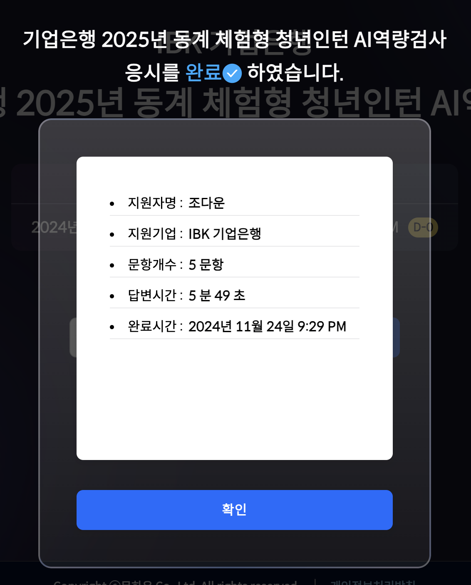

# 기업은행 AI 역량 검사 후기

    

이전까지 기업은행 AI 역량 검사는 5 개의 문항이 제시된 후 진행되었다. 하지만 2025년 동계 체험형 청년인턴 AI 역량 검사 때는 "몬스터" 플랫폼을 이용하여 자기소개서 기반의 질문으로 진행되었다.

## 질문

**1. 자기소개해주세요.**

저는 도전을 통해 끊임 없이 성장해왔고 이를 통한 성취에서 일에 대한 본질적인 재미를 느껴왔습니다.IBK 기업은행은 생성형 AI 기반 소상공인 디지털 경영 지원 서비스 등 금융 혁신을 선도하고 있습니다. 이는 도전과 성장을 중시하는 제 가치관과 잘 맞습니다. 디지털 혁신에 참여해 금융 기술적 요구사항을 이해하고,기술과 금융이 결합한 가치를 창출하며 기여하고 싶습니다.

- 미리 준비한 답변을 말했다.

**2. 자신의 희망직무에 대해 발휘할 수 있는 장점(역량) 은 무엇인가요?**

소통 능력을 먼저 말했다. 어떤 직무던 소통 능력은 필수이며 이어서 명확한 요구사항은 완성도 있는 결과물을 도출할 것이란 이야기를 했다. 남녀노소 사용하는 금융 서비스에서 사용자 경험 분석 역량을 (데이터 활용 능력) 바탕으로 사용자 친화적인 서비스 개발이 가능하다는 이야기를 했다. 기업은행의 디지털 혁신에 기여할 수 있을 것 같다.

**3. 기업은행 인턴 활동을 통해 얻고 싶은 것은 무엇인가요?**

금융과 기술의 융합을 경험하고 싶습니다. 현재 다수의 프로젝트를 진행하며 개발 능력은 많이 쌓아왔지만 금융권에 대한 지식은 이론을 통해서만 얻어왔습니다. 금융과 기술이 융합되었을 때의 실무 경험을 기업은행 인턴 활동에서 경헙하고 싶습니다.

**4. Nuxt.js와 Editor.js를 활용해 에디터를 구현하는 프로젝트에서 어떤 점이 가장 어려웠나요?**

Nuxt.js 와 Editor.js 가 당시 신기술이었어서 자료가 부족했고 익숙하지 않은 점이 가장 어려웠다고 말했다. 라이브러리 특성 상 필요한 부분은 직접 연구하여 수정해야 했는데 자료가 없어 쉽지 않았다. 하지만 기업 대표님께 여쭤보았을 때, 기술 스택을 공부할 때 공식 문서만큼 훌륭한 학습법이 없다는 조언을 듣고 공식 문서를 공부하며 해당 기술을 사용했다. 이후 스스로 알게 된 점을 블로깅하는 등 지식 공유를 진행하며 완전히 내 것으로 만들 수 있었다.

- 이런 이야기를 했다... 시간 채우는 게 너무 어려웠다 내 대답은 10 초 짜리인데

**5. 디자인 팀과 협력하여 복잡한 인터랙션 대신 사용자 경험을 유지할 수 있는 대안을 제시하였다고 했는데 어떤 방법을 제시하였나요?**

인터랙션을 자바스크립트를 사용하여 직접 구현하지 않고 애니메이션 영상으로 추출하여 lottie 이미지 등을 사용해 인터랙션의 효과를 낼 수 있게 하였다. 이를 통해 서버 부하를 줄였다. 그리고 ssr, server side rendering 을 적극적으로 사용하여 사용자에게 완전히 로딩되기 전 확인 가능한 콘텐츠가 있도록 하여 사용자 경험을 높였습니다. 또 사용자와 상호작용하는 컴포넌트와 아닌 컴포넌트의 로딩 순서에 차이를 두었습니다.

## 전체

화면의 한 곳만 쳐다보면서 다른 곳으로 시선이 안 가도록 하는 것이 많이 신경 쓰였다. 그래서 더 긴장됐다. 차라리 사람이 앞에 있다면 대화하는 기분이었을텐데 질문도 앞에 계속 떠있어서 답변이 막히니까 질문을 계속 다시 읽는 행위를 반복했다. (눈알이 굴렀다는 뜻,,,) 너무 너무 긴장되었다. 혼자 독백 연기하는 것처럼 말하는 방법을 연습해야겠다는 생각을 했다. (그래서 더뮤지컬에 가입할 뻔 했다,,, 연기를 배우는 거야) 말의 속도나 발음은 영상 보니까 괜찮았던 것 같다. 이번에는 첫 AI 역량 검사라서 빨리 해버리고 싶다는 생각이 많이 들어서 후딱 끝내버리고 망했다.

폴로 회색 맨투맨을 단정하답시고 입고 현승 오빠한테 외모 체크 받았다가 크게 혼날 뻔 했당 아ㄴ이보리 니트 입으라는데 난 뭔 다 지퍼 찍찎 달린 껄렁 니트 밖에 없어서 하얀 셔츠 고데기로 다려 입었다.

## 미리 준비한 것들

1. gpt 를 사용하여 자소서 기반 예상 질문을 받았다.
2. 단정한 셔츠와 묶은 머리! 하얀 조명.
3. 기업은행의 서비스에 대해 조사했다.
4. 면접 전 photo booth 를 통해 미리 질문에 대한 답을 하는 연습 영상을 찍었다.
